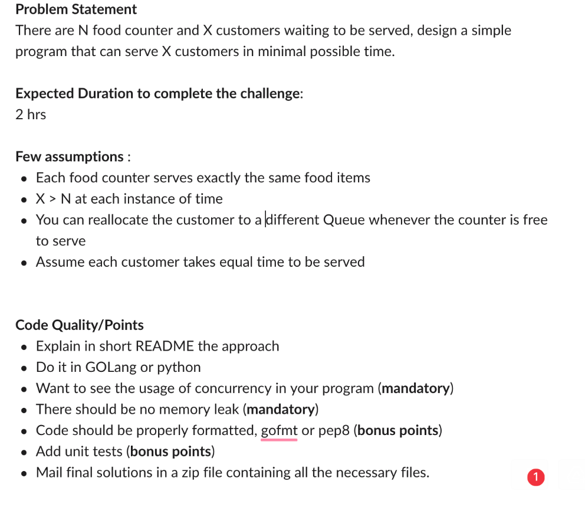

# assignment-sib

### Requirements
- Go Lang (tested on go version : go1.15 linux/amd64)

### How to run -
```shell script
$ go build -o executable
$ ./executable
```

### Test 
```shell script
 $ go test ./...
```

## Problem



### Short Technical Description 
An channel is used to keep a customer that will be sent to the food counter for serving.

Customer data (dummy data) are being written to this channel in a goroutine.

Multiple consumers (food counter in our case) are listening to this channel.

As soon as an element is written to this channel, from the pool of food counter, one food counter will serve (process) the customer.
